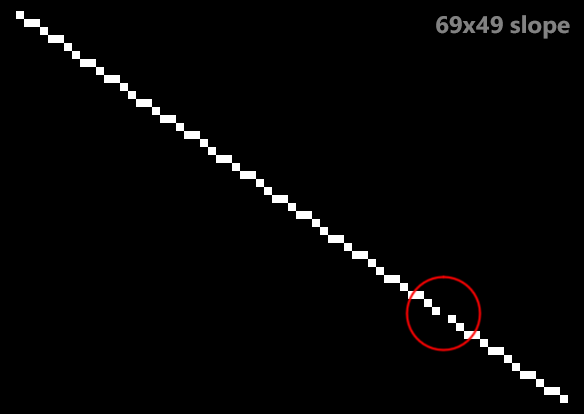
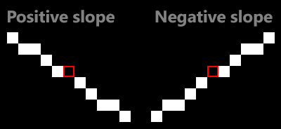

# nds-interp

This is a pixel-perfect implementation of the Nintendo DS's interpolation algorithm for slopes. Every possible slope is generated with perfect accuracy, including the gaps that occasionally appear in some slopes.

## Nintendo DS slope interpolation

The Nintendo DS hardware uses 32-bit integers with 18-bit fractional parts throughout the interpolation process, with one notable exception in X-major slopes.

To calculate the X increment per scanline (), the hardware first computes the reciprocal of Y1-Y0 then multiplies the result by X1-X0. This order of operations avoids a multiplication overflow at the cost of precision on the division.

For X-major lines, the interpolator produces line spans for each scanline. The start of the span is calculated by first offseting the Y coordinate to the Y0..Y1 range (subtracting Y0 from Y), then multiplying the offset Y by , adding the X0 offset and finally a +0.5 bias. The end on the span is computed based on its starting coordinate, discarding (masking out) the 9 least significant bits (which could be seen as rounding down, or the floor function), then adding  and subtracting 1.0. The exact algorithm is unknown, but it is possible that the starting coordinate is shifted right by 9 for an intermediate calculation then shifted back left by 9 to restore the fractional part.

The formulae for determining the starting and ending X coordinates of a span of an X-major slope are:

> \
> \
> \
> \
> 

Due to the 9 least significant bits being discarded, certain X-major slopes (such as 69x49, 70x66, 71x49 and more) display a one-pixel gap on hardware (as seen below). This is calculated accurately with the formulae above.

Y-major slopes contain only one pixel per scanline. The formula for interpolating the X coordinate based on the Y coordinate is very similar to that of the X-major interpolation, with the only difference being that the +0.5 bias is not applied.

> 

Note that there is no need to compute a span as there's always going to be only one pixel per scanline. Also, there are no one-pixel gaps on Y-major lines since the Nintendo DS's rasterizer is scanline-based and the interpolation is computed on every scanline.

Negative slopes work in a similar fashion. In fact, negative slopes perfectly match their positive counterparts down to the one-pixel gaps which happen in exactly the same spots. The gaps in negative slopes are to the left of a span, while in positive slopes the gaps are to the right of a span, as shown below (rows 34 to 41 of 69x49 slopes):

## Building and running

This project is a Visual Studio solution, but the code should easily compile on other platforms with a C++17 compiler. The NDS ROMs used to generate the data files as well as their source code is located in the [nds-interp/data/src](nds-interp/data/src) folder. See its [README](nds-interp/data#readme) for more details.

The program requires the slope data captured from a Nintendo DS, DS Lite, DSi or 3DS, which you can find in [`nds-interp/data/data.7z`](nds-interp/data/data.7z). Simply extract that file into the containing folder and you should be good to go, if you're using Visual Studio. On other IDEs or platforms you might have to set the working directory to the folder containing the `data` folder (i.e. `nds-interp`).
